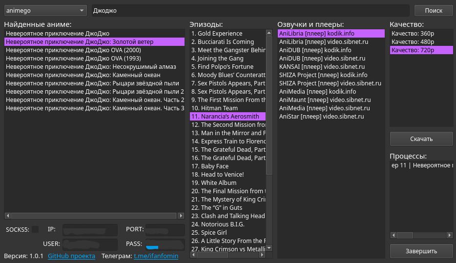

# Anime Downloader
## Вот так ывглядит

*ДжоДжо просто для примера, много частей, много сезонов, много серий, много озвучек*
- скачивает в `Загрузки/Anime/`
## Возможности
- Скачивает аниме с русской озвучкой или субтитрами
- Можно скачивать несколько видео сразу
- Можно указать socks5 прокси если есть проблемы с доступом к источнику (через него точно будет работать, если не заработает через просто впн на пк. Можно нажать галочку чтобы вкл/выкл)
## Установка
### Скачать релиз под вашу систему
(ссылка на релизы)
### Либо собрать самим
0. Сборка не отличается на Linux или Windows (кроме пункта 6.1.)
1. Скачиваете репозиторий
2. Открываете проект CMakeLists.txt в QtCretor
3. Делаете виртуальное окружение `python3 -m venv .venv`, входите в него
4. Устанавливаете зависимости `pip install -r backend/requirements.txt`
5. Собираете backend `python backend/build_backend.py`
6. Собираете Qt проект  
6.1. (Для полной независимости приложения на Windows пришлось ещё отдельно из терминала запустить `C:\Qt\6.x.x\mingw_x64\bin\windeployqt.exe animedl.exe` будучи в одной директории с animedl.exe)
7. Наслаждаетесь жизнью, пейте чай после занятий
## Основные спользованные библиотеки и ПО
- anicli-ru - основное апи, на котором и основывается всё приложение
- QtCreator - весь фронт на Qt
- VSCode - весь бэк на Python
- yt-dlp - непосредственное скачивание медиа (.m3u8, .mp4)
