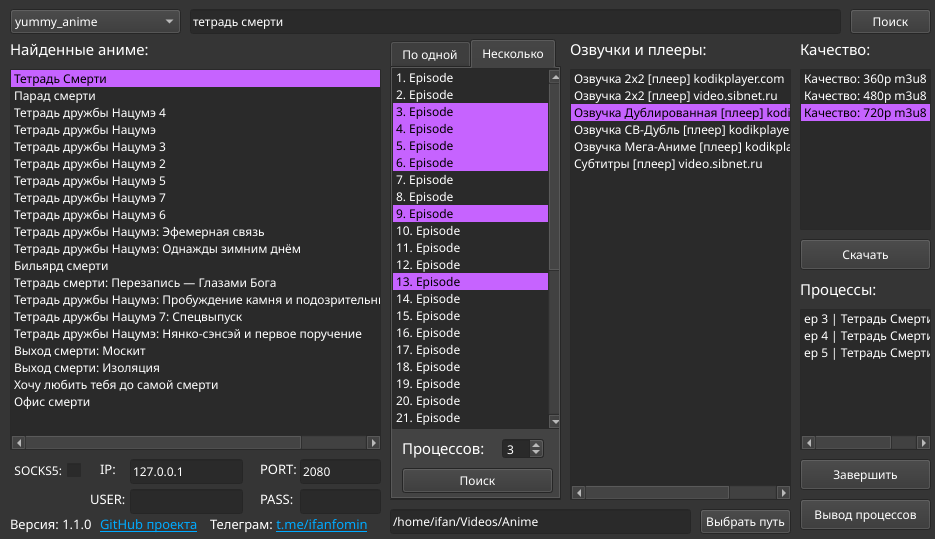
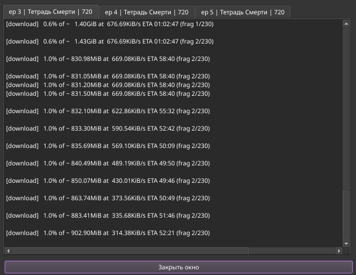
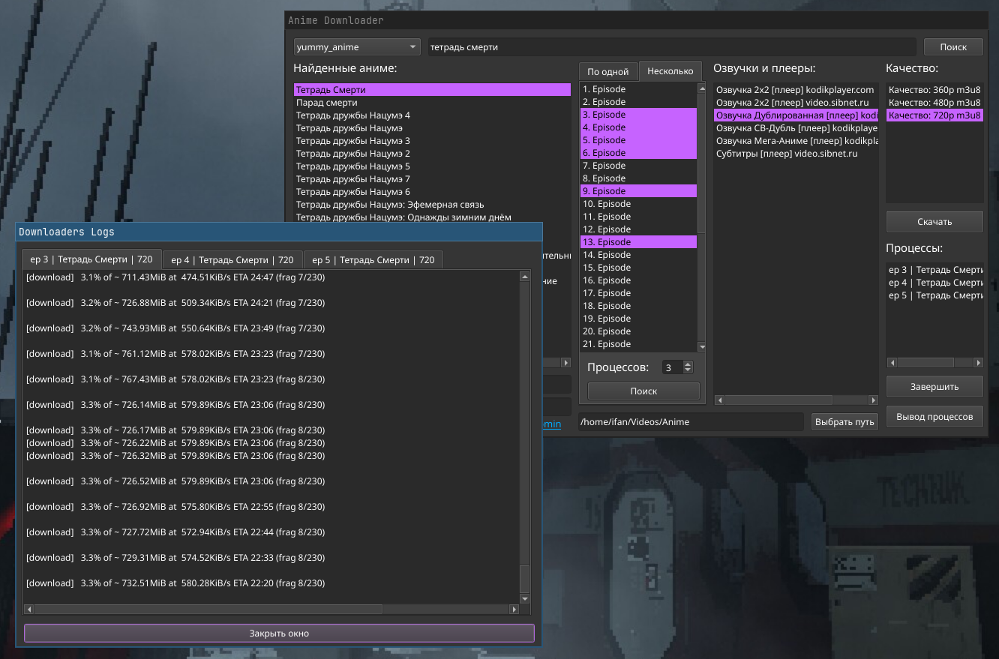

# Anime Downloader

## Вот так выглядит

  
  
  
*Я уже и не знаю что добавить*

## Возможности

- Скачивает аниме с русских сервисов
- Можно удобно скачивать несколько видео сразу, деля на процессы
- Можно указать socks5 прокси
- Можно указать путь для скачивания
- Можно смотреть выводы процессов

## Установка

### Скачать релиз под вашу систему

[Послдений релиз animedl v1.1.1](https://github.com/Ifanfomin/anigui-dl-ru/releases/tag/v1.1.1)

### Либо собрать самим

1. В системе уже должны быть QtCreator и Python
2. Скачиваете репозиторий
3. Открываете проект CMakeLists.txt в QtCretor
4. Собираете Qt проект  
5. (Для полной независимости приложения на Windows пришлось ещё отдельно из терминала запустить `C:\Qt\6.x.x\mingw_64\bin\windeployqt.exe animedl.exe`)

## Основные использованные библиотеки и ПО

- [anicli-ru](https://github.com/vypivshiy/ani-cli-ru) - основное апи, на котором и стоится всё приложение
- [QtCreator](https://github.com/qt-creator/qt-creator) - весь фронт на Qt
- [VSCode](https://github.com/microsoft/vscode) - весь бэк на Python
- [yt-dlp](https://github.com/yt-dlp/yt-dlp) - скачивание медиа (.m3u8, .mp4)
